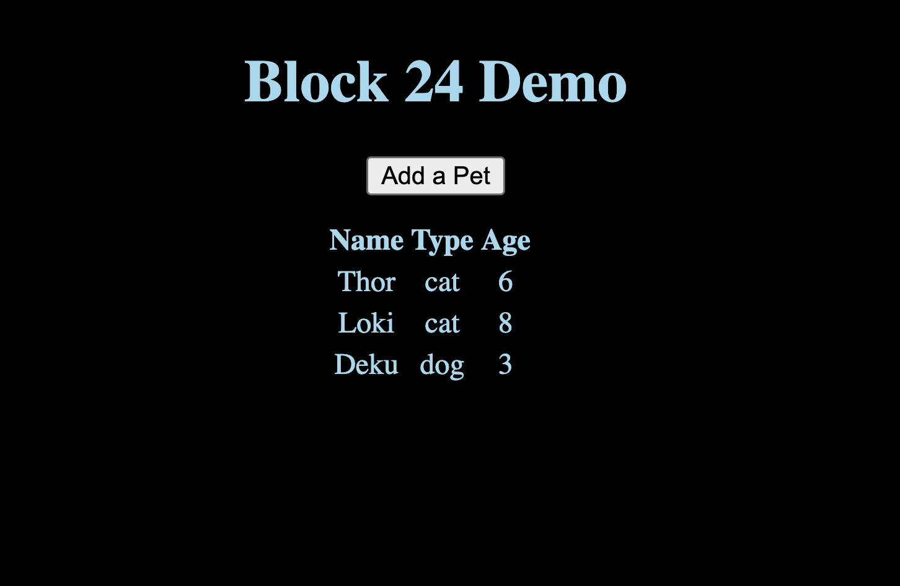
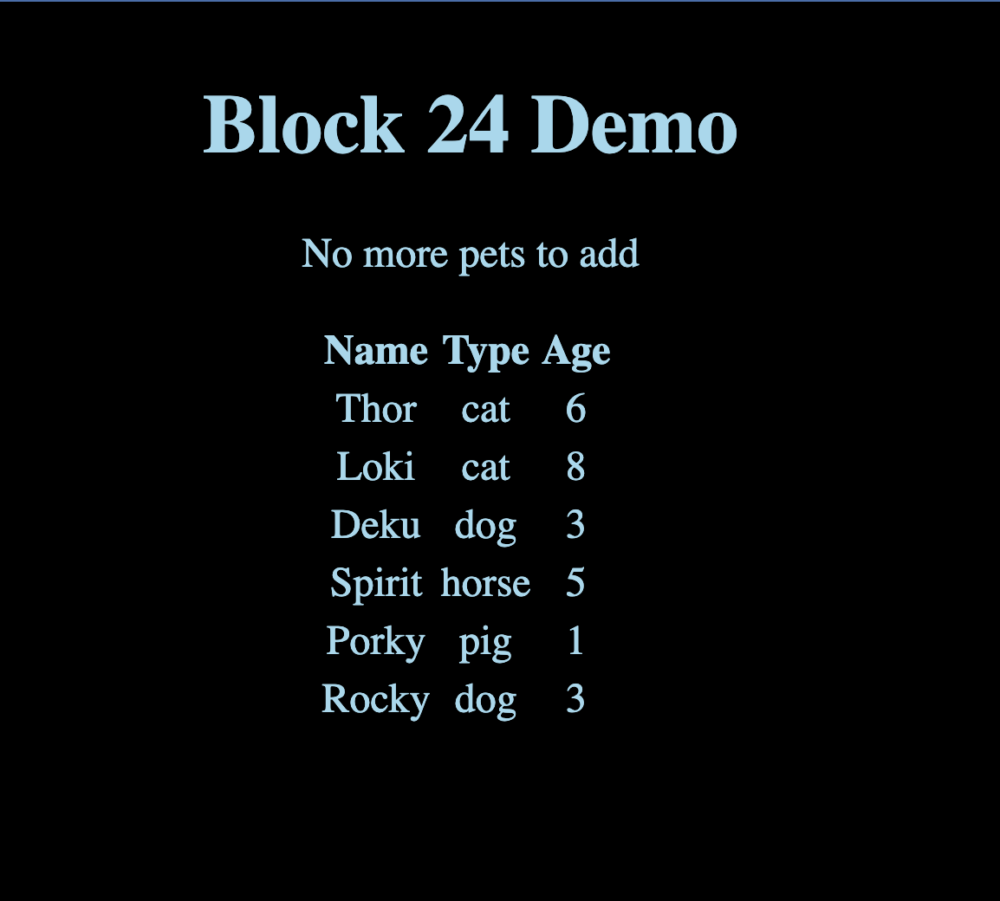

# Block 24: Intro to React

Guided in-class project for Block 24: Intro to React.

In this project we will learn how to build a React application.

## Objectives

- Understand what React is, and what problems it helps us solve
- Write a React Component
- Use the `useState` React hook
- Understand different ways to work with and spin up a React application
- Map over lists of data, and render them in React.
- CREATE YOUR FIRST REACT APPLICATION!

## Introduction

We are going to re-create the Block 19 DOM demo using React.

One change we're going to make is that we will not set an interval to add a new pet but instead we will have a button that will add a new pet to our list of pets.

## Steps to complete the project

1. Using your command line, navigate into the project folder
2. Run `npm create vite@latest` in your command line to create a react application
   - The command will run through a series of prompts. Answer with the following:
     - ? Project name: block24_demo
     - ? Select a framework: React
     - ? Select a variant: JavaScript
3. `cd` into the `block24_demo` folder and run `npm i` in your command line to install the necessary files
4. Remove the following from the newly created React project
   - README file
   - /src/assets folder
   - /src/index.css file
5. Update the following files:
   - /src/main.jsx
     - line 4: remove un-needed import
   - /src/App.jsx
     - lines 10-32: remove and add an `h1` with a title of `Block 24 Demo` inside a `div`
     - lines 2-3: remove un-needed imports
     - line 5: remove un-need count state
   - src/App.css
     - remove all lines from CSS file
     - add CSS to be in dark mode by default (reference the Block 20 demo CSS file)
   - .eslintrc.cjs
     - lines 5-6: remove `eslint:recommended` and `plugin:react/recommended` to remove propType linting errors (since we will get those errors for our application)
   - index.html
     - line 5: remove un-needed icon
     - line 7: update title to `Block 24: Intro to React Demo`
6. Run `npm run dev` in your command line to start the React Application. You should see the following in your terminal:
   
7. Copy the url next to the `Local` and paste it in your browser. You should see the following in the browser:
   
8. Import `useState` from react
9. Using `useState` create a state for our pets using the following as our default state:

```js
[
  { id: 1, name: "Thor", type: "cat", age: "6" },
  { id: 2, name: "Loki", type: "cat", age: "8" },
  { id: 3, name: "Deku", type: "dog", age: "3" },
];
```

10. In the `return` of our component create a `table` for our pets
    - map through the pets array and return a row that shows the pet's name, type and age
11. Add a key property to each `div` and set the key as each pet's id
    - Note the key property needs to be unique so make sure you choose some attribute of what you're mapping over that will be unique no matter which element in the array you're on
12. Using `useState` create a state for our new pets using the following as our default state:

```js
[
  { id: 4, name: "Rocky", type: "dog", age: "3" },
  { id: 5, name: "Porky", type: "pig", age: "1" },
  { id: 6, name: "Spirit", type: "horse", age: "5" },
];
```

14. Add a button in our component above our list of pets to add a new pet to our list
15. Create a function above our `return` statement called `addPet` which will add a pet from our new pets array into our pets array
    - update newPets using the state change function so we remove the pet from the array
    - update pets using the state change function to add the new pet
16. Add an `onClick` to our button so that it calls our `addPet` function when clicked
17. Add a check in our component that shows a message `No more pets to add` instead of the button if the `newPets` is empty

If all goes well your application should look like:


After all pets added:

